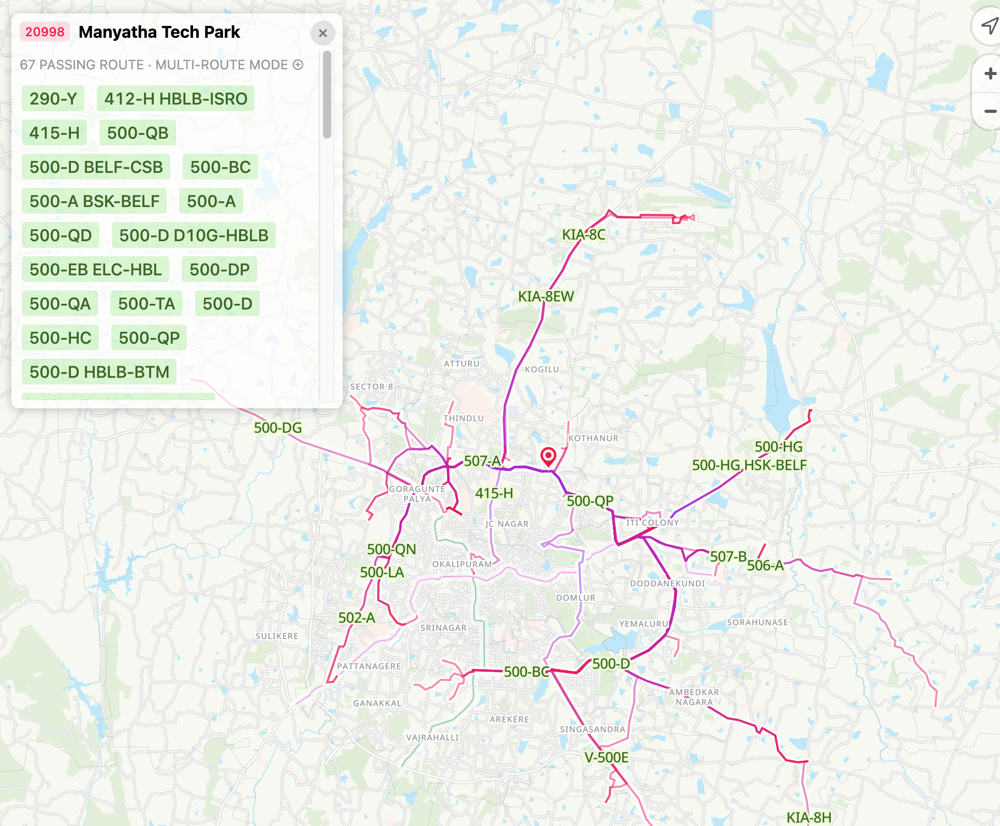
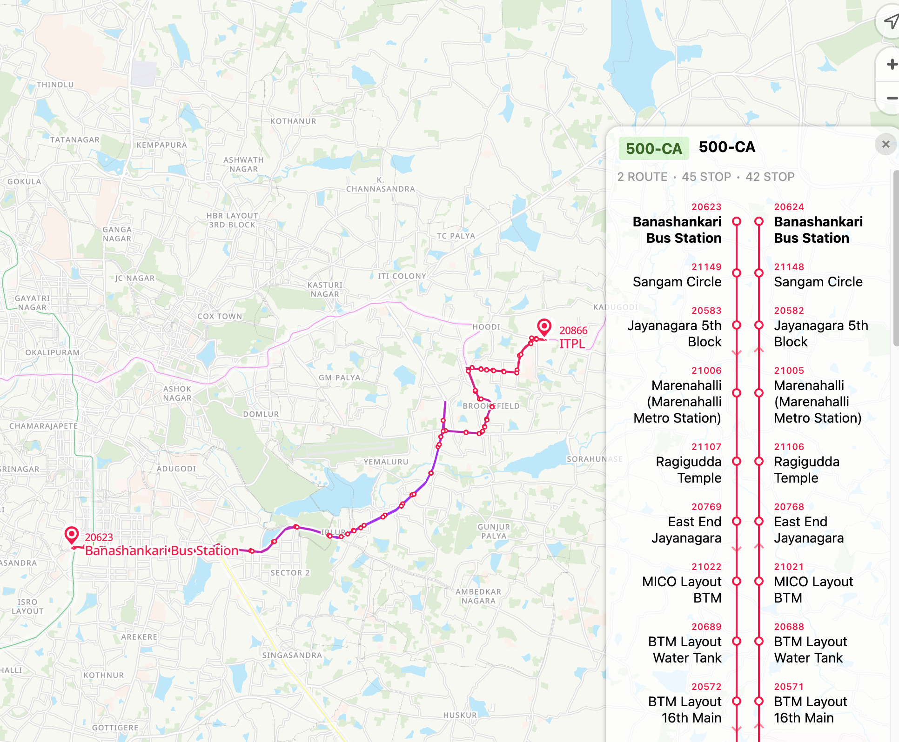

# TransitRouter

Forked from BusRouter SG: https://github.com/cheeaun/busrouter-sg

Explore transit stops and routes across multiple cities on an interactive map.

[**Website**](https://transitrouter.vonter.in/)

## Features

- **All** transit stops shown even in low zoom levels.
- **Full routes** display with all stops for every service.
- View all routes **passing through** a stop.
- Supports **any** transit network with a GTFS feed.
- Display **live** arrival times and vehicle locations for supported transit networks.
- Render **spider diagrams** for major routes through any transit stop.

## Develop

- Install dependencies with `pnpm install` (or `npm install`)
- Prepare JSON files for the web app with `pnpm run prebuild` (or `npm run prebuild`)
- Start local dev server with `pnpm run start` (or `npm run start`)
- Build site deployment assets with `pnpm run build` (or `npm run build`)

## Data

Refer to [DATA.md](DATA.md) for more details on the data sources and processing scripts.

## TODO

- Base Functionality:
    - `bus-diagram/` page for visualizing major stops of major routes passing through the selected stop
- User Experience
    - Navigation flow
    - Typography/styling of elements
- Extend Support:
    - Add OSM to rail.json script
    - CI Pipeline to process all GTFS
    - More cities
    - Cleanup unused dependencies and components
- Release Collaterals:
    - Update styling for OpenFreeMap tiles to resemble original PMTiles
    - New custom assets for TransitRouter
- Future Goals:
    - `bus-pois/` page for visualizing POIs accessible by routes passing through the selected stop (POIs by category, distance from stop, etc.)
    - Interchange stops support
    - Multi-operator support
    - Multi-modal support
    - Categorizing routes and stops by frequency or importance

## License

[MIT](LICENSE)

## Credits

- Forked from [BusRouter SG](https://github.com/cheeaun/busrouter-sg/)
