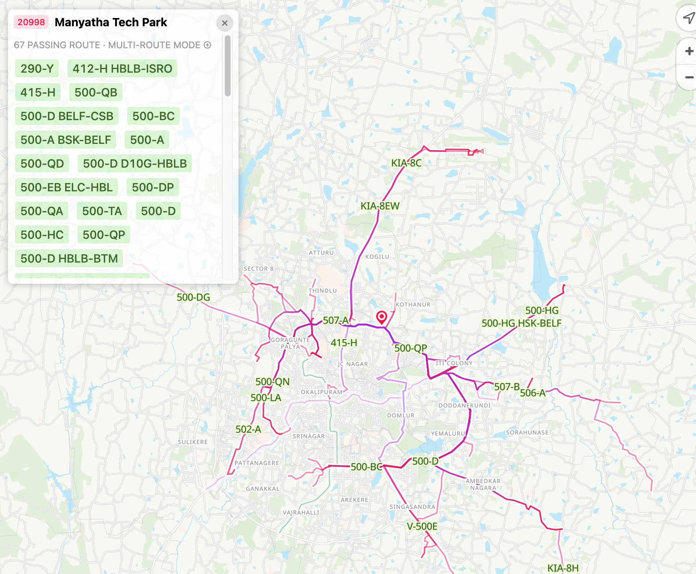
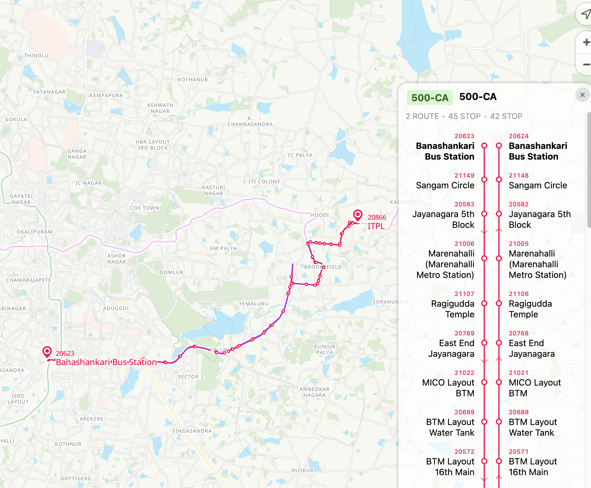

# TransitRouter

Forked from BusRouter SG: https://github.com/cheeaun/busrouter-sg

Explore transit stops and routes across multiple cities on an interactive map.

[**Website**](https://transitrouter.vonter.in/)

[](https://transitrouter.vonter.in/)

[](https://transitrouter.vonter.in/)

## Features

- **All** transit stops shown even in low zoom levels.
- **Full routes** display with all stops for every service.
- View all routes **passing through** a stop.
- Supports **any** transit network with a GTFS feed.
- Display **live** arrival times and vehicle locations for supported transit networks.
- Render **spider diagrams** for major routes through any transit stop.

## Develop

### Setup

1. Install dependencies:
   ```sh
   pnpm install
   ```

2. Prepare data files for the web app:
   ```sh
   pnpm run data
   ```

3. (Optional) To process raw GTFS feeds from scratch:
   ```sh
   pnpm run gtfs
   ```

### Development

Start the local development server:
```sh
pnpm run dev
```

This builds the site, then runs Parcel (watch mode) and Wrangler Pages concurrently. Parcel rebuilds on source changes, and Wrangler serves the output with live reload and Cloudflare Functions (API endpoints for live arrivals, vehicle tracking, etc.).

Alternatively, `pnpm run start` runs a frontend-only Parcel dev server on port 8888 with hot module replacement. This is faster to start but does not include Cloudflare Functions.

### Production

```sh
pnpm run build
```

This runs the full pipeline: data preparation, Parcel build, and post-build steps (headers generation, static asset copying).

### Notes

- **Service workers** are automatically disabled on localhost so that code changes are reflected immediately without stale caches.
- **API calls** in development automatically use the current origin, so they work with whatever port the dev server is running on.
- **E2E tests** can be run with `pnpm run test:e2e` (uses Playwright).

## Data

Refer to [DATA.md](DATA.md) for more details on the data sources and processing scripts.

## TODO

- User Experience
    - Show stop suffix in title of arrivals page
    - Navigation flow
    - Typography/styling of elements
    - More cities
- Release Collaterals:
    - Update styling for OpenFreeMap tiles to resemble original PMTiles
    - New custom assets for TransitRouter
- Future Goals:
    - Enhance design and rendering of stop diagrams on `diagram/` page
    - `bus-pois/` page for visualizing POIs accessible by routes passing through the selected stop (POIs by category, distance from stop, etc.)
    - Interchange stops support
    - Multi-operator support
    - Multi-modal support
    - Categorizing routes and stops by frequency or importance

## License

[MIT](LICENSE)

## Credits

- Forked from [BusRouter SG](https://github.com/cheeaun/busrouter-sg/)
